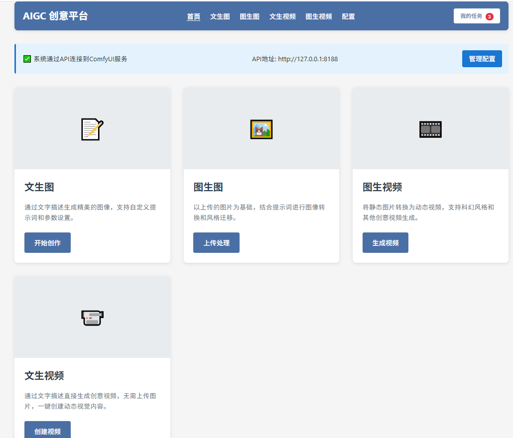
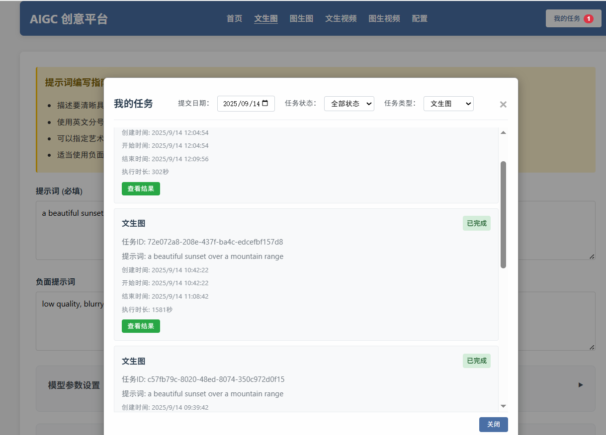
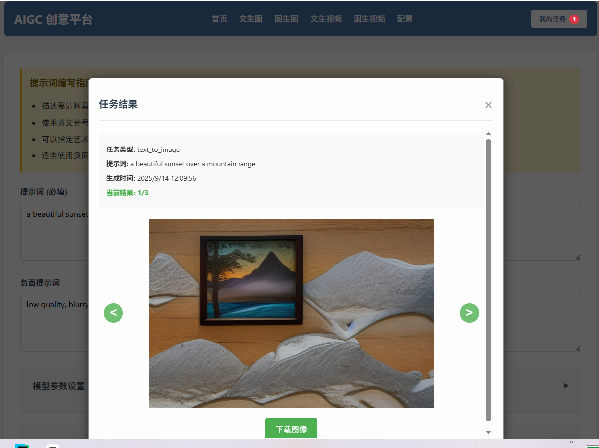
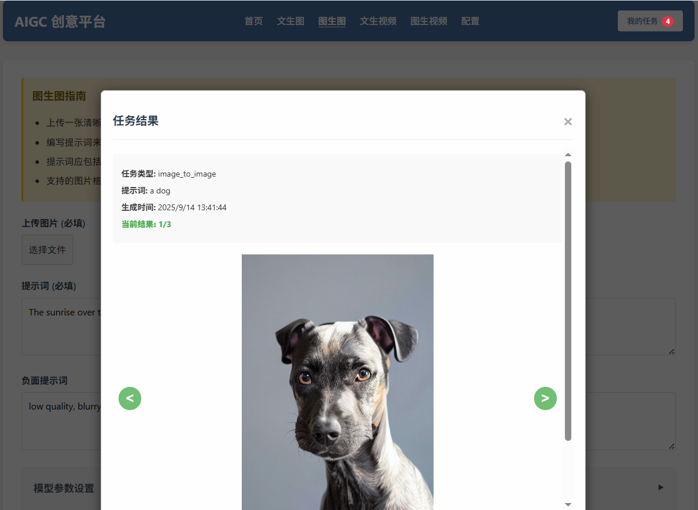
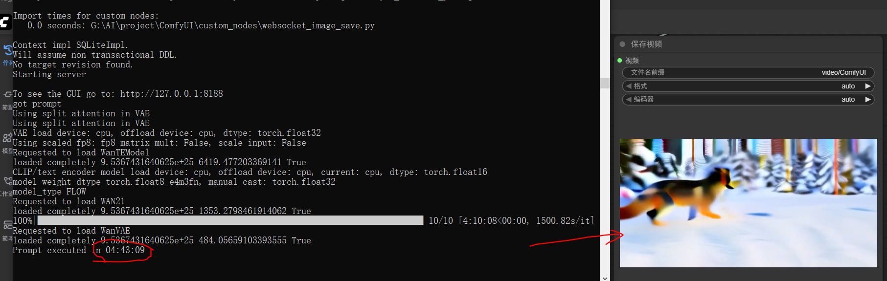

# AIGC 创意平台

这是一个功能丰富的AIGC（人工智能生成内容）平台，基于ComfyUI工作流，集成了多种先进的AI生成模型，实现了文生图、图生图、文生视频、图生视频等多种创意生成功能。

## 1. 系统介绍

### 核心功能

- **文生图**：通过文本描述生成高质量图像
- **图生图**：基于输入图像生成新的图像变体
- **文生视频**：通过文本描述生成高质量视频
- **图生视频**：将静态图像转换为动态视频
- **特定场景应用**：
  - 更多场景持续开发中...

### 技术架构

- **底层框架**：基于ComfyUI工作流引擎，提供强大的模型编排能力
- **支持模型**：集成SD (Stable Diffusion)、SVD (Stable Video Diffusion)、Flux、Wan2等多种先进生成模型
- **双界面设计**：同时提供Streamlit和Flask两种Web界面，满足不同使用习惯
- **模块化设计**：采用组件化架构，易于扩展新功能和场景
- **任务队列**：支持异步任务处理和重试机制，提高系统稳定性

### 项目结构

```
├── hengline/        # 核心代码目录
│   ├── core/        # 核心队列处理
│   ├── flask/       # Flask应用相关代码
│   ├── streamlit/   # Streamlit界面组件
│   ├── task/        # 任务管理
│   └── utils/       # 工具函数库
│   └── workflow/    # 工作流处理
├── workflows/       # ComfyUI工作流配置文件
├── configs/         # 系统配置文件
├── start_app.py     # Streamlit应用启动脚本
├── start_flask.py   # Flask应用启动脚本
└── requirements.txt # 项目依赖文件
```


## 2. 安装步骤

### 前提条件

- Python 3.8 或更高版本
- pip 包管理器
- 足够的磁盘空间用于存储模型和生成结果
- 推荐配置：具有CUDA支持的NVIDIA GPU（用于加速生成过程）

### 安装过程

#### 步骤1：安装ComfyUI

本项目基于ComfyUI工作流，首先需要安装ComfyUI：

1. 从GitHub克隆ComfyUI仓库：
   ```bash
   git clone https://github.com/comfyanonymous/ComfyUI.git
   ```

2. 安装ComfyUI依赖：
   ```bash
   cd ComfyUI
   pip install -r requirements.txt
   ```

3. 下载所需的模型文件（如SD、Wan等），并放置在ComfyUI/models 的相应目录中：

   > 1. **文生图、图生图**（共约2G）：
   >
   >    /**checkpoints**/[v1-5-pruned-emaonly-fp16.safetensors](https://hf-mirror.com/Comfy-Org/stable-diffusion-v1-5-archive/resolve/main/v1-5-pruned-emaonly-fp16.safetensors)
   >
   > 
   >
   > 2. **图生视频**（共约21G）：
   >    - /**text_encoders**/[t5xxl_fp16.safetensors](https://hf-mirror.com/comfyanonymous/flux_text_encoders/resolve/main/t5xxl_fp16.safetensors)（9.2G）
   >    - **/diffusion_models** / [wan2.2_ti2v_5B_fp16.safetensors](https://huggingface.co/Comfy-Org/Wan_2.2_ComfyUI_Repackaged/resolve/main/split_files/diffusion_models/wan2.2_ti2v_5B_fp16.safetensors)（9.3G）
   >    - /**vae**/[wan2.2_vae.safetensors](https://hf-mirror.com/Comfy-Org/Wan_2.2_ComfyUI_Repackaged/resolve/main/split_files/vae/wan2.2_vae.safetensors)（1.3G）
   >    - **/clip_vision** / [clip_vision_h.safetensors](https://huggingface.co/Comfy-Org/Wan_2.1_ComfyUI_repackaged/resolve/main/split_files/clip_vision/clip_vision_h.safetensors?download=true)（1.2G）
   >
   > 
   >
   > 3. **文生视频**（共约20G）：
   >    - /**text_encoders**/[t5xxl_fp16.safetensors](https://hf-mirror.com/comfyanonymous/flux_text_encoders/resolve/main/t5xxl_fp16.safetensors)（9.2G）
   >    - /**vae**/[wan2.2_vae.safetensors](https://hf-mirror.com/Comfy-Org/Wan_2.2_ComfyUI_Repackaged/resolve/main/split_files/vae/wan2.2_vae.safetensors)（1.3G）
   >    - **/diffusion_models** / [wan2.2_ti2v_5B_fp16.safetensors](https://huggingface.co/Comfy-Org/Wan_2.2_ComfyUI_Repackaged/resolve/main/split_files/diffusion_models/wan2.2_ti2v_5B_fp16.safetensors)（9.3G）

   > 
   >
   > 4. **文生音频**（共约5G）：
   >    - /**text_encoders**/[t5-base.safetensors](https://huggingface.co/ComfyUI-Wiki/t5-base/resolve/main/t5-base.safetensors)（850M）
   >    - /**checkpoints**/[stable-audio-open-1.0.safetensors](https://huggingface.co/Comfy-Org/stable-audio-open-1.0_repackaged/resolve/main/stable-audio-open-1.0.safetensors)（4.5G）

4. 启动 ComfyUI 

   ```python
   python main.py
   
   # 以CPU 模式启动
   python main.py --cpu
   
   # 压缩模型启动
   python main.py --cpu  --use-split-cross-attention --disable-smart-memory --windows-standalone-build
   ```

   

#### 步骤2：安装本项目

1. 克隆或下载本项目到您的计算机：
   ```bash
   git clone <项目仓库地址>
   cd ai-diffusion-aigc
   ```

2. 使用提供的启动脚本自动完成安装：
   - 对于Streamlit界面：运行`python start_app.py`
   - 对于Flask界面：运行`python start_flask.py`

   > 启动脚本将自动：
   > - 检查Python环境
   > - 创建/激活虚拟环境（.venv）
   > - 安装项目依赖
   > - 启动相应的Web服务
   
   

## 3. 使用说明

### 配置系统

1. 修改配置文件：
   打开`configs/config.json`文件，根据您的环境修改以下配置：
   - `comfyui.api_url`：设置为您的ComfyUI URL（可在界面修改）
   - `user`部分：设置用户接收的邮箱
   - `settings`部分：根据需要调整生成参数

2. 工作流配置：
   项目包含多个预设的工作流文件，存放在`workflows/`目录中，您可以根据需要修改或创建新的工作流。


### 启动应用

#### 方法一：使用Streamlit界面（调试）

1. 运行启动脚本：
   ```bash
   python start_app.py
   ```

2. 脚本会自动安装依赖并启动Web界面。

3. 在浏览器中打开显示的URL（通常是http://localhost:8501）。

4. 在Web界面中，配置相关参数后即可使用各项功能。

#### 方法二：使用Flask界面（推荐）

1. 运行启动脚本：
   ```bash
   python start_flask.py
   ```

2. 在浏览器中打开显示的URL（通常是http://localhost:5000）。

3. 在Web界面中，配置相关参数后即可使用各项功能。

### 功能使用

- **文生图**：输入文本描述，调整相关参数，点击生成按钮获取图像结果
- **图生图**：上传参考图像，输入文本描述，调整参数后生成新图像
- **文生视频**：输入文本描述，调整相关参数，点击生成按钮获取动态视频
- **图生视频**：上传静态图像，设置视频参数，生成动态视频


## 4. 效果图展示

硬件资源有限，在CPU环境，都是用的最低配参数和模型生成的效果。


### Streamlit界面效果图


#### 文生图效果


#### 图生图效果


### Flask界面效果图



我的任务



#### 文生图效果

```json
{
  "prompt": "a beautiful sunset over a mountain range",
  "negative_prompt": "low quality, blurry, unrealistic, static, boring",
  "width": 576,
  "height": 384,
  "steps": 8,
  "cfg": 7.5,
  "denoise": 0.75,
  "batch_size": 3
}
```




#### 图生图效果

原图


参数：

```json
{
  "prompt": "a dog",
  "negative_prompt": "low quality, blurry",
  "width": "624",
  "height": "304",
  "steps": "10",
  "cfg": "6.5",
  "denoise": "0.55",
  "batch_size": "3"
}
```




#### 文生视频效果

本人选的最低参数和最低配的模型，本地电脑用 CPU 环境测试。

内存占用始终 80% 以上，用时近 5 小时才完成。

	16.0 GB
	
	可用	2.7 GB
	已缓存	2.1 GB
	已提交	21.5/29.7 GB
	分页缓冲池	939 MB
	非分页缓冲池	1.0 GB
	使用中(已压缩)	13.0 GB (143 MB)


最低配的效果图，画面很模糊（5 步，512 * 256, 7秒时长）。用的 umt5_xxl_fp8_e4m3fn_scaled.safetensors




#### 图生视频效果

暂未调试


## 5. 注意事项

- 本项目使用的AI模型可能需要大量的计算资源，尤其是在生成视频时。
- 生成的内容应遵守相关法律法规，不得用于非法用途。
- 定期更新您的模型文件以获得更好的生成效果。
- 如果您在使用过程中遇到问题，可以查看 ComfyUI 的官方文档或提交 Issue。

